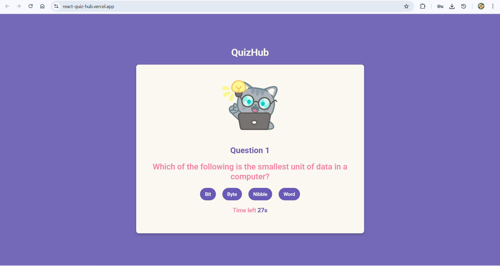

# React QuizHub

A quiz app built with **React**.
It's a simple and interactive quiz app.

## 🌐 Live Demo
Check out the live version of this project [here](https://react-quiz-hub.vercel.app/).

## 🚀 Features
- Provides four answer options with one correct choice.
- Includes a timer for each question to increase challenge.
- Offers a restart option to replay the quiz anytime.
- Built with **React Hooks**

## 📸 Preview


## 🛠️ Technologies Used
- **React.js**  
- **JavaScript**  
- **HTML5**  
- **CSS3**  
- **Vite**
- **Prettier**

## 📦 Installation
```bash
git clone https://github.com/osvi-25/react-QuizHub.git
cd react-QuizHub
npm install
npm start
```

## 🧑‍💻 Usage
1. Read the question and choose the correct answer from four options. 
2. Track time left.
3. At the end, view your final score and restart if you wish.
